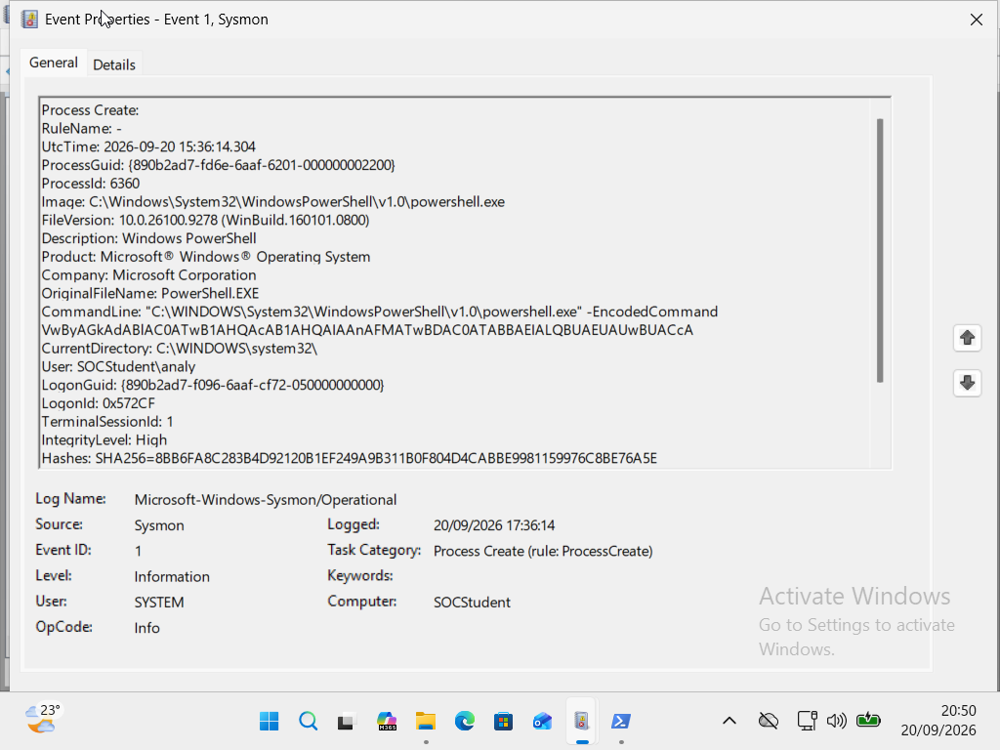
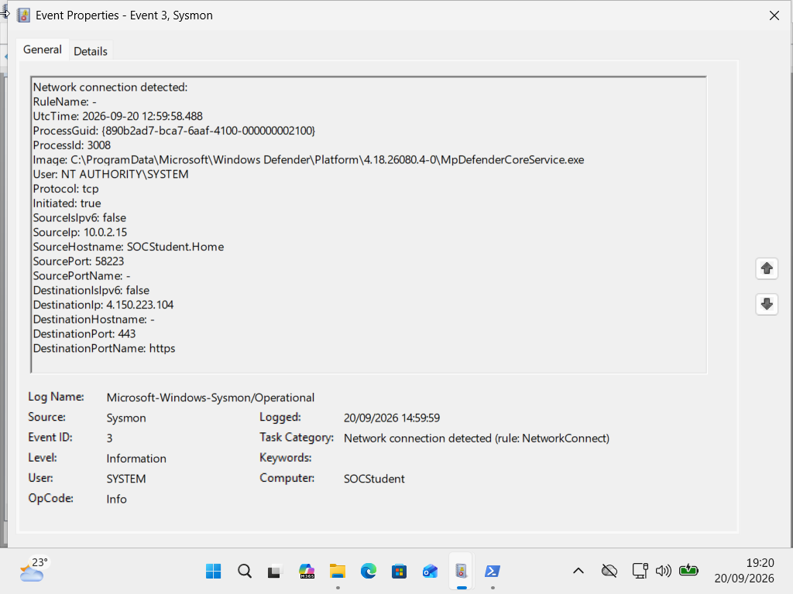
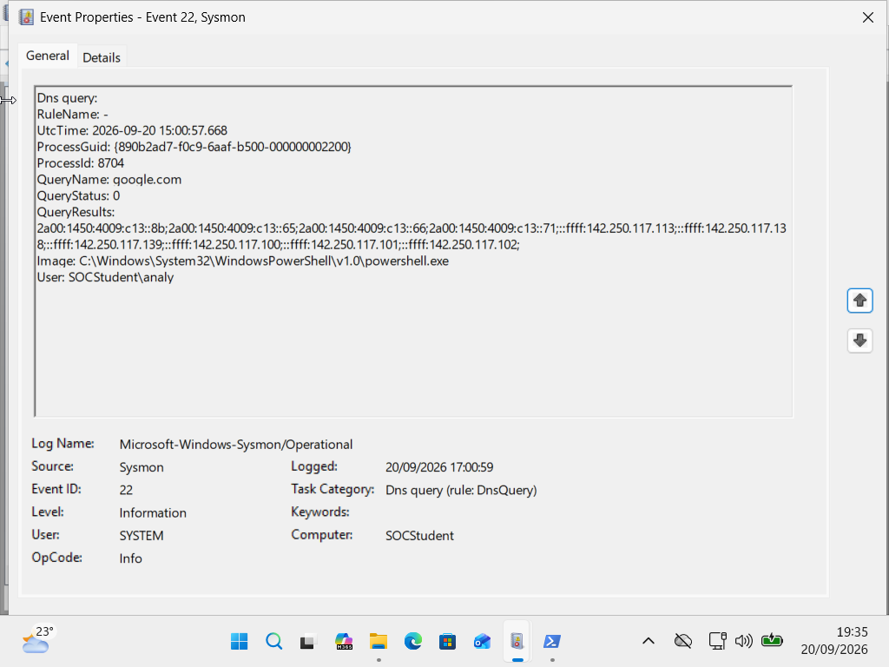

# Lesson 05 — Detecting Suspicious PowerShell Activity

## Objective

Investigate potentially suspicious PowerShell activity using Windows Event Logs and Sysmon telemetry.

## Skills Demonstrated

- PowerShell process analysis
- Sysmon Event ID 1 analysis
- Sysmon Event ID 3 analysis
- Process ID correlation
- Base64 encoded PowerShell analysis
- Network connection analysis
- Evidence-based SOC investigation
- Avoiding premature conclusions

## Investigation Summary

A controlled PowerShell process was created using the `-EncodedCommand` parameter.

The encoded command was safely decoded and produced:

`Write-Output 'SOC-LAB-TEST'`

The decoded command was a controlled test command and did not demonstrate malicious behavior.

A separate Sysmon Event ID 3 recorded an outbound connection:

- Process: `taskhostw.exe`
- Process ID: `7184`
- Source IP: `10.0.2.15`
- Destination IP: `40.84.97.4`
- Destination Port: `443`
- Initiated: `true`

The PowerShell process had Process ID `6360`.

Because the Process IDs were different, the available telemetry did not establish that PowerShell initiated the network connection.

## Key SOC Finding

Matching Process IDs can help correlate Sysmon events to the same process instance.

Different Process IDs should not automatically be treated as the same process activity.

## Analyst Conclusion

The use of PowerShell `-EncodedCommand` and an external network connection can raise suspicion and should be investigated. However, these indicators alone do not prove malicious activity.

Further investigation may include decoding the command, reviewing EDR telemetry, examining related process activity, and validating the destination IP.

## Evidence
### Evidence 1 — PowerShell Process Creation

Sysmon Event ID 1 was used to identify the PowerShell process and obtain its Process ID.

- Process: `powershell.exe`
- Process ID: `6360`
- User: `socstudent\analy`
- Command line contained `-EncodedCommand`

### Evidence 2 — Network Connection

Sysmon Event ID 3 recorded a network connection initiated by `taskhostw.exe`.

- Process: `taskhostw.exe`
- Process ID: `7184`
- Source IP: `10.0.2.15`
- Destination IP: `40.84.97.4`
- Destination Port: `443`
- Initiated: `true`

### Evidence 3 — DNS Query

Sysmon Event ID 22 recorded a DNS query generated by PowerShell.

- Query: `google.com`
- Process: `powershell.exe`
- Process ID: `8704`
- Query Status: `0` (successful DNS response)

### Evidence 4 — Controlled Encoded Command

The Base64-encoded PowerShell command was decoded in the controlled lab environment.

Decoded command:

`Write-Output 'SOC-LAB-TEST'`

The decoded command only produced test output and did not demonstrate malicious behavior.

## Lessons Learned

- Encoded PowerShell is not automatically malicious.
- Public IP addresses are not automatically malicious.
- `Initiated: true` indicates that the local side initiated the connection.
- Process ID is useful for correlating process-related telemetry.
- Evidence should be analyzed before reaching a conclusion.

Investigation Timeline

All timestamps below are recorded in UTC from the Sysmon telemetry.

UTC Timestamp| Event ID| Process| PID| Activity
"2026-09-20 12:59:58.488"| 3| "taskhostw.exe"| 7184| Outbound connection to "40.84.97.4:443"
"2026-09-20 15:00:57.668"| 22| "powershell.exe"| 8704| DNS query for "google.com", QueryStatus "0"
"2026-09-20 15:36:14.304"| 1| "powershell.exe"| 6360| PowerShell executed with "-EncodedCommand"

Correlation Analysis

The Event ID 3 network connection was associated with "taskhostw.exe" (PID 7184), while the PowerShell events had different Process IDs (8704 and 6360).

Because the Process IDs and timestamps do not establish a common process instance, the available telemetry does not support attributing the "40.84.97.4:443" connection to the PowerShell process.

The DNS query was successfully completed ("QueryStatus: 0"), but successful DNS resolution does not by itself indicate malicious or benign activity.

The use of "-EncodedCommand" raised suspicion and required further investigation. The controlled Base64 value was decoded to:

"Write-Output 'SOC-LAB-TEST'"

The decoded command produced test output and did not demonstrate malicious behavior.

Analyst Assessment

The investigation demonstrates the importance of correlating process identity, Process ID, timestamps, and supporting telemetry before attributing network activity to a process.

The available evidence raises investigative interest around the encoded PowerShell activity, but it does not establish malicious behavior.

Further investigation would include reviewing EDR telemetry, related process activity, command-line context, destination-IP context, and additional Windows/Sysmon events.
