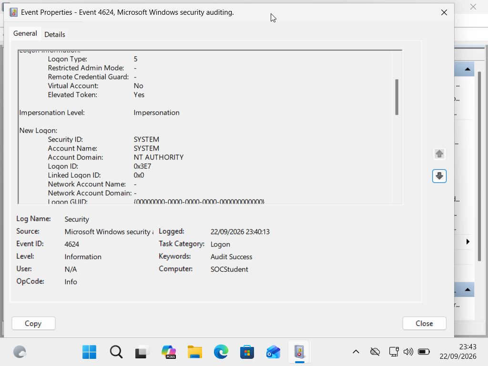
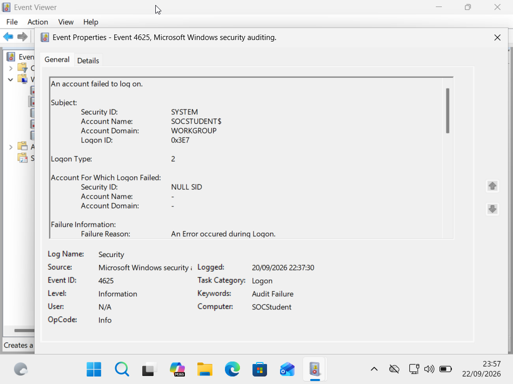
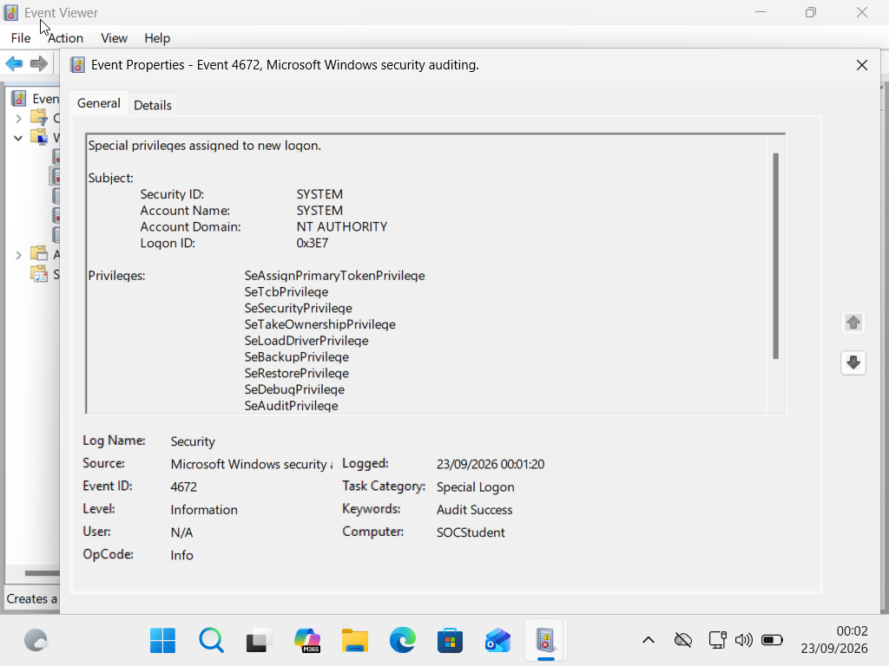

Lesson 6 — Windows Authentication & Account Activity Investigation

Objective

Investigate Windows authentication and account activity using Windows Security Event Logs and apply SOC investigation techniques to identify unusual authentication activity, privileged logons, account activity, and possible security concerns.

Skills Demonstrated

- Windows authentication log analysis
- Windows Security Event ID analysis
- Logon Type analysis
- Failed and successful authentication investigation
- Privileged logon analysis
- Logon ID correlation
- Authentication timeline analysis
- Evidence-based security assessment
- SOC investigation and documentation

Windows Events Investigated

Event ID| Meaning| SOC Use
4624| Successful logon| Identify successful authentication
4625| Failed logon| Investigate failed authentication attempts
4672| Special privileges assigned| Identify privileged logon activity
4740| Account locked out| Investigate account lockouts
4720| User account created| Investigate account creation
4726| User account deleted| Investigate account deletion

Logon Types Studied

- Type 2 — Interactive logon
- Type 3 — Network logon
- Type 5 — Service logon
- Type 10 — Remote Interactive / RDP logon

Actual Lab Evidence

Event ID 4624 — Successful Logon

A Windows Security Event ID 4624 was examined during the lab.

Observed information included:

- Account: SYSTEM / "socstudent$"
- Logon Type: 5
- Source Network Address: blank
- 

The event demonstrated a successful service logon. The event was not classified as malicious based on the event alone.

Event ID 4625 — Failed Logon

A controlled failed authentication was generated in the Windows SOC lab.

Observed information included:

- Account: "socstudent$"
- Logon Type: 2
- Source Network Address: "127.0.0.1"
- Failure information recorded by Windows
- 

The activity was generated intentionally during the lab and therefore was not treated as a brute-force attack.

Event ID 4672 — Special Privileges Assigned

A Windows Security Event ID 4672 was examined.

Observed information included:

- Account: SYSTEM
- Logon ID: "0x3e7"
- Special privileges assigned to the logon
- 

The presence of SYSTEM and special privileges was not considered malicious by itself. Additional context would be required before making a security determination.

Authentication Correlation

A controlled investigation scenario was used to practice correlating:

"4625 → 4625 → 4624 → 4672"

This represented failed authentication attempts followed by successful authentication and privileged activity.

The investigation demonstrated that this sequence can be unusual and should be investigated, but it does not automatically prove that an account has been compromised.

Correlation should consider:

- Account
- Logon Type
- Source address
- Timestamp
- Logon ID
- Related authentication events
- EDR and process telemetry
- Organizational context

Important Correlation Lesson

A Logon ID identifies a Windows logon session, while a Process ID (PID) identifies a process instance.

Logon ID is therefore useful for correlating Windows authentication and security events, while PID and ProcessGuid are useful for correlating process-related telemetry.

Controlled Investigation Scenarios

Events 4740, 4720, and 4726 were investigated using controlled SOC scenarios because corresponding events were not generated during the lab exercises.

Event ID 4740

Used to investigate account lockout activity and possible causes such as:

- Repeated incorrect passwords
- Old credentials stored in a scheduled task
- Mapped network drives
- Other devices using outdated credentials
- Possible password-guessing activity

Event ID 4720

Used to investigate user account creation.

Key distinction:

- Target Account — account that was created
- Subject Account — account that performed the account-creation action

Event ID 4726

Used to investigate user account deletion.

Key distinction:

- Target Account — account that was deleted
- Subject Account — account that performed the deletion

Analyst Approach

The investigation followed an evidence-first approach:

1. Identify the Windows event.
2. Examine the account involved.
3. Examine the Logon Type.
4. Review source information.
5. Compare timestamps.
6. Correlate related events.
7. Validate the activity with additional telemetry.
8. Avoid declaring an activity malicious without sufficient evidence.

Analyst Conclusion

The investigation demonstrated how Windows authentication events can be used to reconstruct account activity and identify unusual authentication patterns.

The presence of failed logons, successful logons, privileged activity, account creation, or account deletion does not automatically indicate malicious behavior.

A SOC analyst should correlate the available evidence, validate the source and account activity, review additional telemetry, and consider organizational context before reaching a final determination.
Section 9 — Authentication Investigation Exercise

Investigation Scenario

The following controlled scenario was analyzed:

Time| Event| Account| Logon Type| Source
08:41:02| 4625| administrator| 10| 203.0.113.50
08:41:05| 4625| administrator| 10| 203.0.113.50
08:41:08| 4624| administrator| 10| 203.0.113.50
08:41:09| 4672| administrator| —| Logon ID 0x7A21

Analyst Observation

Two failed remote interactive logons were followed by a successful remote interactive logon for the administrator account from the same source address. A 4672 event then recorded special privileges for the administrator account.

Correlation Analysis

The 4625 and 4624 events can be associated based on the same account, Logon Type, source address, and close timestamps.

The 4672 event requires additional correlation because the provided 4624 scenario did not include its Logon ID. Matching the 4624 Logon ID with "0x7A21" would provide stronger evidence that both events belong to the same Windows logon session.

Analyst Assessment

The sequence is unusual and warrants investigation, but the available evidence does not by itself prove that the administrator account was compromised.

Possible legitimate explanations could include an authorized remote user entering an incorrect password before successfully authenticating.

Additional Evidence to Investigate

- Windows Security authentication events
- RDP logs
- EDR telemetry
- Firewall and network logs
- VPN logs, where applicable
- IAM and MFA records
- Source IP ownership and organizational context
- Account-owner or IT confirmation
- Process activity following the successful logon

Key Lesson

Unusual authentication activity should trigger investigation, not an automatic malicious classification.

A SOC analyst should correlate the available evidence, validate the activity against organizational context, and gather additional telemetry before reaching a final determination.
